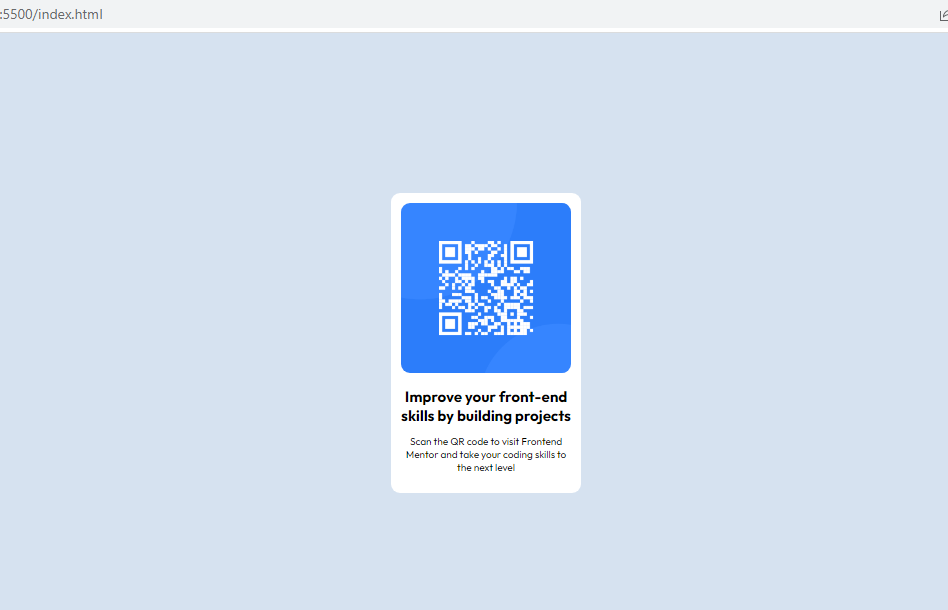

# Frontend Mentor - QR code component solution

This is a solution to the [QR code component challenge on Frontend Mentor](https://www.frontendmentor.io/challenges/qr-code-component-iux_sIO_H). Frontend Mentor challenges help you improve your coding skills by building realistic projects. 

## Table of contents

- [Overview](#overview)
  - [Screenshot](#screenshot)
  - [Links](#links)
- [My process](#my-process)
  - [Built with](#built-with)
  - [What I learned](#what-i-learned)
  - [Continued development](#continued-development)
  - [Useful resources](#useful-resources)
- [Author](#author)

## Overview

### Screenshot



### Links

- Solution URL: (https://github.com/Igraziella/Frontend-mentor_challenges/tree/main)
- Live Site URL: ( https://igraziella.github.io/frontend-mentor_challenges)

## My process

### Built with

- Semantic HTML5 markup
- CSS custom properties
- Flexbox

### What I learned

Css could be a bit tricky when one is not familiar with element attributes.

```css
.proud-of-this-css {
  box-sizing: border-box;
  box-sizing: content-box;
}

### Continued development

I'm still trying to get familiar with attributes of elements in html & css. I realised that some elements do not take certain attributes. for example, the img element cannot have a colour attribute, but can take a width and height attribute. It's going to take some getting used to but i'll keep practicing.

### Useful resources

- https://blog.hubspot.com/website - This is an amazing article which helped me understand positioning and the flex property. I'd recommend it to anyone still learning this concept.

## Author

- Website - [Obialor Ijeoma](https://www.your-site.com)
- Frontend Mentor - [@igraziella](https://www.frontendmentor.io/profile/Igraziella)
- Linkedin - [Obialor Ijeoma](https://www.linkedin.com/in/ijeoma-obialor-012494114)